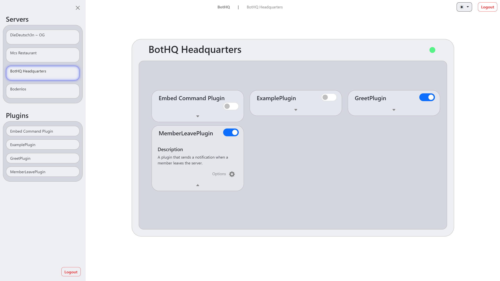

<style>
    :root {
        color: #444;
        font-size: 22px;
        letter-spacing: .5pt;
        text-align: left;
    }

    section ul {
        margin-left: 0;
    }

    img[alt~="center"] {
        display: block;
        margin: 0 auto;
    }

    p {
        line-height: 1.5;
    }
    code {
        font-family: 'Fira Mono', monospace;
        font-weight: 500;
        background-color: transparent !important;
        line-height: 1.2;
        text-shadow: 0;
    }
</style>

### Mittelstufenprojekt<br/>Discord-Bot-Framework


#### 5. Juni 2024

#### Philipp Batelka, Jan Mahnken, Daniel Quellenberg,<br>Fabian Reichwald, Justus Sieweke, Christopher Spencer

---

# Was ist BotHQ?

BotHQ ist ein modulares Framework zum Hinzufügen und zur Verwaltung unseres Discord-Bots. Es bietet eine benutzerfreundliche Weboberfläche und eine robuste API zur Integration und Verwaltung von Plugins.

Durch die Verwendung von Plugins kann unser Bot automatisch verschiedene Aufgaben ausführen, wie das Senden von Nachrichten, die Moderation von Benutzern, das Hosten von Spielen und sogar das Abspielen von Musik.

---

# Projektübersicht

**Ziel des Projekts:**
Die Entwicklung eines modularen Discord-Bot-Frameworks, das als Cloud-Service angeboten wird und eine einfache Verwaltung von Plugins ermöglicht.

**Zielgruppe:**

- Gamer und Gaming-Communities
- Entwickler und Technikbegeisterte
- Unternehmen und Organisationen
- Content Creator und Streamer

**Nutzen:**
BotHQ erleichtert die Verwaltung und Konfiguration eines universellen Discord-Bots, indem es eine benutzerfreundliche Oberfläche und eine flexible API bietet.

---

# Funktionen und Features

### Hauptfunktionen

- **Plugin-Verwaltung:** Einfache Aktivierung, Deaktivierung und Konfiguration von Plugins

- **Benutzerfreundliche Weboberfläche:** Intuitive Verwaltung über das Frontend

- **Discord-Bot-Integration:** Nahtlose Einbindung in Discord-Server

### Anwendungsfälle

- **Moderation:** Automatische Verwaltung und Moderation von Discord-Servern

- **Engagement:** Interaktive Features für Community-Engagement

- **Automatisierung:** Automatisierung wiederkehrender Aufgaben und Prozesse

---

## Vorteile des Frameworks

- **Automatisierte Einrichtung**: BotHQ automatisiert den Einrichtungsprozess des Discord-Bots.

- **Benutzerfreundliche Oberfläche**: Eine intuitive Weboberfläche zur effizienten Verwaltung des Bots und Plugins.

- **Modulares Framework**: Erweiterbar durch Hinzufügen neuer Plugins.

- **Sicher und Zuverlässig**: Fokus auf Sicherheit und Zuverlässigkeit.

- **Cloud-basierter Service**: Hosting auf zuverlässiger Cloud-Plattform.

---

<!-- ## Screenshots -->



---


---

# Technische Betrachtung

---

## Entwicklungsprozess

**Vorgehensmodell:**
Das Projekt wurde nach dem agilen Scrum-Framework durchgeführt, angepasst an die spezifischen Bedürfnisse des Teams.

**Sprints und Meilensteine:**

- **Sprint 1:** Anforderungsanalyse und Datenbankdesign
- **Sprint 2:** Implementierung der Kernfunktionen und Design
- **Sprint 3:** Erstellung von Plugins, Testen, Feinschliff

**Herausforderungen und Lösungen:**

- **Herausforderung:** Datenbankanpassungen während der Entwicklung
- **Lösung:** Flexibles Datenbankschema und kontinuierliche Integration

---

## Technologie-Stack

**Verwendete Technologien:**

- **Backend:** Spring Boot
- **Frontend:** Angular
- **Datenbank:** PostgreSQL
- **API:** REST
- **Bot-Integration:** JDA (Java Discord API)

**Warum diese Technologien?**

- **Spring Boot:** Framework für robuste Backend-Entwicklung
- **Angular:** Frontend-Framework für dynamische Webanwendungen
- **PostgreSQL:** Skalierbare Datenbanklösung
- **JDA:** Bibliothek für die Integration von Discord-Bots in Java

---

## Architektur des Systems

### Komponenten

- **Core:** Grundlegende Logik und Datenverarbeitung
- **Lib(rary):** Wiederverwendbare Bibliotheken und Utilities
- **Frontend:** Benutzeroberfläche zur Verwaltung von Servern, des Bots und Plugins
- **Discord-Plugins:** Individuelle Plugins für spezifische Bot-Funktionen

### Interaktionen

- **API:** Kommuniziert zwischen Frontend und Backend
- **Datenbank:** Speichert Nutzerdaten, Bot-Konfigurationen und Plugin-Einstellungen

---


---

## Wichtige Klassen und Module – Backend

### Core

- Der Kern des Discord-Bot-Frameworks.
- Verantwortlich für die grundlegenden Funktionen und die Verwaltung der Bot-Operationen.
- Interagiert mit anderen Modulen und Diensten, um Befehle zu verarbeiten und Benutzer zu verwalten.

| Core-Services | Beschreibung                                    |
| ------------- | ----------------------------------------------- |
| `BotService`  | Steuert den Betrieb des Discord-Bots            |
|               | Verarbeitet Befehle und Ereignisse              |
|               | Interagiert mit Plugins                         |
| `UserService` | Verwalten der Benutzerinformationen und -rollen |
|               | Authentifizierung und Autorisierung             |

---

### Library

- Eine Sammlung von Hilfsfunktionen.
- Macht den Code sauberer und wiederverwendbar.
- Spart Zeit bei der Entwicklung.

| Library           | Beschreibung                                           |
| ----------------- | ------------------------------------------------------ |
| `UtilityFunction` | Allgemeine Hilfsfunktionen                             |
|                   | Methoden für String-Manipulationen, Formatierungen     |
|                   | und Validierungen                                      |
|                   | Reduziert Code-Duplikationen                           |
| `DatabaseHelper`  | Vereinfachung von Datenbankoperationen                 |
|                   | Verwaltung von Abfragen und Transaktionen              |
|                   | Unterstützung bei der Erstellung von Datenbankschemata |

---

## Wichtige Klassen und Module – Frontend

- Die Benutzeroberfläche des Discord-Bot-Frameworks.
- Ermöglicht Nutzern, den Bot einfach zu verwalten.
- Zeigt wichtige Informationen und erlaubt die einfache Konfiguration.

| Frontend-Komponenten     | Beschreibung                                         |
| ------------------------ | ---------------------------------------------------- |
| `DashboardComponent`     | Zentrale Übersicht und Verwaltung                    |
|                          | Darstellung von Statistiken und Statusinformationen  |
|                          | Navigation zu Verwaltungskomponenten                 |
| `PluginManagerComponent` | Verwaltung und Konfiguration von Plugins             |
|                          | Aktivierung, Deaktivierung und Anpassung von Plugins |
|                          | Schnittstelle zur Backend-API                        |

---

## Plugins

- Zusätzliche Funktionen, die der Bot ausführen kann.
- Erweitern die Fähigkeiten des Bots.
- Bieten spezifische Funktionen wie Begrüßungen und Moderation.

| Plugins            | Beschreibung                            |
| ------------------ | --------------------------------------- |
| `WelcomePlugin`    | Begrüßt neue Mitglieder auf dem Server  |
|                    | Anpassbare Begrüßungstexte              |
|                    | Unterstützt dynamische Inhalte          |
| `ModerationPlugin` | Verwalten von Servermoderation          |
|                    | Kick- und Ban-Funktionalitäten          |
|                    | Protokollierung von Moderationsaktionen |

---

## Quellcode-Beispiele

### Backend (Spring Boot)

```java
// Verify that the class is of type IPlugin
if (IPlugin.class.isAssignableFrom(cls)) {

    // Create a new instance of the valid class
    var pluginInstance = (IPlugin) cls.getDeclaredConstructor().newInstance();

    log.info("Loaded plugin: {} ({})", className, jarFileName);

    for (var method : cls.getDeclaredMethods()) {
        if (method.isAnnotationPresent(DiscordEventListener.class)) {

            // Non-static methods
            plugin.getEventListeners().put(method, method.getAnnotation(DiscordEventListener.class).value());

            log.info("Added event listener: {}.{} ({})", className, method.getName(), jarFileName);
        }
    }
}
```

---

### Frontend (Angular)

```typescript
export class ServerPluginDataService {
    private pluginListRefresh = new ReplaySubject<void>();
    pluginList$: Observable<PluginData[]>;

    private selectedPluginIdRefresh = new BehaviorSubject<number>(-1);
    selectedPlugin$: Observable<PluginData | undefined>
    
    constructor(private httpClient: HttpClient,
                private authService: AuthService) {
        this.pluginList$ = this.pluginListRefresh.asObservable().pipe(
            switchMap(() => this.getAllPlugins())
        );

        this.selectedPlugin$ = combineLatest([
            this.pluginList$, 
            this.selectedPluginIdRefresh.asObservable()]
        ).pipe(
            map(([plugins, selectedId]) => {
                if (selectedId == -1)
                    return undefined;

                return plugins.find((plugin) => plugin.pluginId == selectedId);
            })
        )

        this.authService.loggedIn$.subscribe(loggedIn => {
            if (loggedIn)
                this.updatePlugins()
        })
    }
}
```
```typescript
export class PluginSettingsComponent {
    pluginData$: Observable<PluginData | undefined>;

    constructor(private pluginDataService: ServerPluginDataService,
                private serverDataService: ServerDataService,
                private httpClient: HttpClient) {

        this.pluginData$ = combineLatest([
            this.pluginDataService.selectedPlugin$, 
            this.serverDataService.selectedServer$]
        ).pipe(
            switchMap(([selectedPlugin, selectedServer]) => 
                this.getSelectedPluginData(selectedPlugin, selectedServer))
        )
    }
}
```


---

### Plugin (Java)

```java
@DiscordEventListener(GuildMemberJoinEvent.class)
public void onGuildMemberJoin(@NotNull GuildMemberJoinEvent event) {
    Guild guild = event.getGuild();
    log.debug("User joined on guild " + guild.getId());

    String channelId = channel.get(guild.getIdLong()).getValue();
    TextChannel greetingChannel = guild.getTextChannelById(channelId);
    if (greetingChannel == null) return;

    log.debug("Greeting channel is \"" + greetingChannel.getName() + "\"");

    String messageValue = message.get(guild.getIdLong()).getValue();
    
    messageValue = messageValue.replace("{user.name}", event.getUser().getEffectiveName());
    messageValue = messageValue.replace("{user.mention}", event.getUser().getAsMention());

    greetingChannel.sendMessage(messageValue).queue();
}
```

---

## Tests und Qualitätssicherung – Work in Progress

**Teststrategie:**

- **Unit Tests:** Überprüfung einzelner Methoden und Funktionen (JUnit, Mockito)
- **Integrationstests:** Überprüfung des Zusammenspiels verschiedener Komponenten
- **Systemtests:** Gesamtsystemtests unter realistischen Bedingungen

**Testergebnisse:**

- **Unit Tests:** geplant sind > 95% Abdeckung
- **Integrationstests:** Erfolgreiche Verbindungen zwischen Komponenten
- **Systemtests:** Alle Hauptfunktionen arbeiten wie erwartet

**Qualitätssicherung:**

- Regelmäßige Code Reviews
- Kontinuierliche Integration und Deployment (CI/CD)

---

## Nutzerdokumentation – Work in Progress

**Benutzerhandbuch:**

- Schritt-für-Schritt-Anleitung zur Installation und Konfiguration
- FAQ und Problemlösungen

**Anleitungen:**

- **Installation:** Einfache Schritte zur Installation des Bots
- **Konfiguration:** Anpassen der Bot-Einstellungen über die Weboberfläche

**Beispiele:**

- **Willkommensnachricht:** Konfigurieren einer Begrüßungsnachricht für neue Mitglieder
- **Moderation:** Automatisiertes Kicken/Bannen von Mitgliedern

---

# Wirtschaftliche Betrachtung – Marktuntersuchung

---

## Zielgruppenanalyse und Marktpotenzial

- **Gaming-Communities**: Beliebt bei Gamern und Gaming-Communities für Management, Spielinformationen und Eventorganisation.

- **Technikbegeisterte und Entwickler**: Benutzerfreundliche Umgebung für Bot-Programmierung und Erstellung eigener Bots.

- **Unternehmen und Organisationen**: Genutzt für Teamkommunikation, Zusammenarbeit und Automatisierung.

- **Content-Ersteller und Streamer**: Interaktion mit der Community, Kontakt mit dem Publikum und Plattform für Fans.

---

## Konkurenzanalyse

**Konkurenzprodukte:** Dyno Bot, Mee6, Carl-bot, GAwesome Bot, Nightbot, BotGhost

**Vorteile von BotHQ:**

- Automatisierte Installation und Konfiguration
- hohe Benutzerfreundlichkeit
- Aktivierung und Konfiguration von Plugins, ohne den Bot neu starten zu müssen
- keine manulle bearbeitung von Dateien nötig
- ohne technische Vorkenntnisse nutzbar

---

## Marktvolumen und Marktpotenzial

- **Nutzerbasis von Discord**: Über 250 Mio. registrierte Nutzer

- **Verwendung von Discord-Bots**: Etwa 30% der Discord-Server nutzen Bots

- **Marktgröße**: Potenzielles Marktvolumen von 30 Mio. aktiven Nutzern

- **Wachstum des Bot-Marktes**: Wachstum des Bot-Marktes

- **Steigende Nachfrage**: Breite Zielgruppe und Erweiterungsmöglichkeiten

- **Wettbewerbsvorteile**: Automatisierte Einrichtung, benutzerfreundliche Oberfläche, modulares Framework, Sicherheit und Zuverlässigkeit

---

## Wachstumschancen

- **Wachstum der Discord-Plattform**: Discord hat in den letzten Jahren eine große Nutzerbasis aufgebaut und wird in verschiedenen Communities und Branchen immer beliebter.

- **Steigende Nachfrage nach Automatisierung**: Immer mehr Discord-Server-Besitzer suchen nach Möglichkeiten, ihre Server zu automatisieren und repetitive Aufgaben zu vereinfachen.

- **Erweiterte Funktionen und Integrationen**: Discord bietet eine umfangreiche API, die es Entwicklern ermöglicht, ihre Bots mit anderen Diensten und Plattformen zu integrieren.

- **Marktexpansion**: Discord wird nicht nur in Gaming-Communities, sondern auch in Bereichen wie Bildung, Unternehmenskommunikation und sozialen Netzwerken immer häufiger genutzt.

---

# Wirtschaftliche Betrachtung – Kostenplanung

<!-- ## Personalkosten

| Projektdaten           | Zeiten und Kosten                 |
| ---------------------- | --------------------------------: |
| Projektzeitraum        | 14. Februar 2024 – 30. Mai 2024 |
| Arbeitszeit            | Mittwochs von 8:10 – 13:20 Uhr  |
| Arbeitszeit pro Woche  | 3,83 Stunden pro Person           |
| Gesamtkosten pro Woche | 1149 EUR                          |
| Anzahl der Wochen      | 16                                |
| Gesamtkosten           | 18.384 EUR                        |

---

## Sachmittelkosten

| Hardware            | Anzahl | Stückkosten | Gesamtkosten |
| ------------------- | -----: | ----------: | -----------: |
| _Laptop (Windows)_  |      2 |    2000 EUR |     4000 EUR |
| _Laptop (Linux)_    |      2 |    1800 EUR |     3600 EUR |
| _Laptop (Mac)_      |      2 |    3000 EUR |     6000 EUR |
| **Hardware gesamt** |        |             |    13600 EUR |

| Software            | Anzahl | Stückkosten | Gesamtkosten |
| ------------------- | -----: | ----------: | -----------: |
| _JetBrains Lizenz_  |      6 |    1500 EUR |     9000 EUR |
| _Webhosting_        |      1 |     200 EUR |      200 EUR |
| _Domain_            |      1 |      10 EUR |       10 EUR |
| _SSL-Zertifikat_    |      1 |      50 EUR |       50 EUR |
| _Backup-Lösung_     |      1 |     300 EUR |      300 EUR |
| _Cloud-Speicher_    |      1 |     200 EUR |      200 EUR |
| **Software gesamt** |        |             |     9760 EUR |
-->

## Gesamtkosten des Projekts

| Kostenart        | Kostenbetrag |
| ---------------- | -----------: |
| Personalkosten   |   18.384 EUR |
| Sachmittelkosten |    9.060 EUR |
| Gesamtkosten     |   27.444 EUR |

---

## Wirtschaftlichkeitsberechnung

### Gewinnschwellenberechnung

| Kostenart                 |               Kostenbetrag |
| ------------------------- | -------------------------: |
| Gesamtkosten des Projekts |                 27.444 EUR |
| Preis des Produktabos     |           10 EUR pro Monat |
| Gewinnschwelle            | 2.745 Abos für einen Monat |

### Amortisationsrechnung

| Dauer                |                           Einnahmen |
| -------------------- | ----------------------------------: |
| Monatliche Einnahmen |       500 Abos x 10 EUR = 5.000 EUR |
| Amortisationszeit    | 27.444 EUR / 5.000 EUR = 5,5 Monate |

---

## Fazit und Ausblick

**Zusammenfassung:**

- Erfolgreiche Entwicklung eines modularen Discord-Bot-Frameworks
- Bereitstellung als Cloud-Service
- Flexible und benutzerfreundliche Verwaltung von Plugins

**Erkenntnisse und Lessons Learned:**

- Wichtige Rolle der agilen Methoden in der Softwareentwicklung
- Bedeutung der Flexibilität bei der Anpassung an neue Anforderungen
- Erfolgreiche Teamarbeit und Kommunikation als Schlüsselfaktoren

**Ausblick:**

- Erweiterung der Plugin-Bibliothek
- Verbesserung der Benutzeroberfläche
- Integration zusätzlicher Funktionen und Dienste