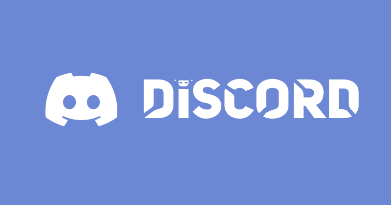

### Mittelstufenprojekt Discord-Bot-Framework

#### 5. Juni 2024

#### Philipp Batelka, Jan Mahnken, Daniel Quellenberg, Fabian Reichwald, Justus Sieweke, Christopher Spencer

---

## Einleitung

---

## Projektbeschreibung

### Projektidee und Zielsetzung

- Ein modularer, cloudbasierter Dienst zur Verwaltung von Discord-Bots

### Anforderungen

- Cloudbasiert
- Einfachache Nutzung für erfahrene/unerfahrene Nutzer
- Framework zur simplen entwicklung neuer Bots

---

## Planungsphase

### Projektplanung

- Jira
- Scrum
- 3 Sprints a ~ 1 Monat

### Ressourcenplanung

- Teamzusammensetzung und Verantwortlichkeiten
- Benötigte Hardware und Software
  

---

## Umsetzung

### Entwicklung des Frameworks

- Webapplication auf Sgring-Boot Basis
- Spring Boot, Angular, REST API, PostgreSQL

### Hauptfunktionen und Features

- Modulares Plugin-System
- Benutzerfreundliche Weboberfläche
- Integration mit der Discord-API
- Beispiel-Plugins (Willkommensnachricht, Rollenverwaltung, etc.)

---

## Herausforderungen und Lösungen

### Technische Herausforderungen

- Anpassungen der Datenbankstruktur
- Integration der verschiedenen Technologien

### Rechtliche Herausforderungen

- Datenschutzbestimmungen und Discord-ToS

### Lösungsansätze

- Wie wurden die Herausforderungen gemeistert?

---

## Projektergebnisse

### Erreichte Ziele

- Übersicht der implementierten Funktionen und Features

### Nicht erreichte Ziele

- Was konnte nicht umgesetzt werden und warum?

### Änderungen zur ursprünglichen Planung

- Anpassungen während der Projektlaufzeit und deren Gründe

---

## Wirtschaftliche Betrachtung

### Marktuntersuchung

- Zielgruppenanalyse und Marktpotenzial

### Kostenplanung

- Personalkosten und Sachmittelkosten

### Wirtschaftlichkeitsberechnung

- Gewinnschwellenberechnung und Amortisationsrechnung

---

## Fazit

### Erfahrungen und Erkenntnisse

- Persönlicher Gewinn und technisches Know-how

### Ausblick

- Möglichkeiten zur Weiterentwicklung des Projekts
- Zukünftige Herausforderungen und Chancen

---

## Fragen und Diskussion

- Einladung zur Fragerunde
- Offene Diskussion
